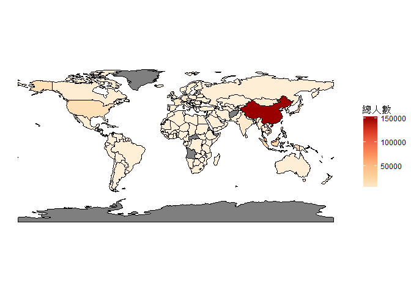
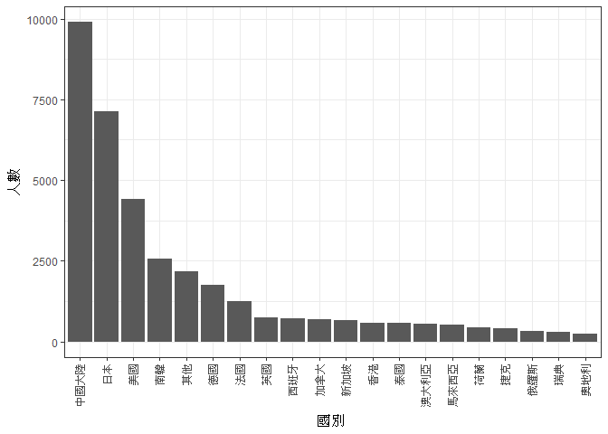

106-2 大數據分析方法 作業二
================
B0444102嚴信虹

作業完整說明[連結](https://docs.google.com/document/d/1aLGSsGXhgOVgwzSg9JdaNz2qGPQJSoupDAQownkGf_I/edit?usp=sharing)

學習再也不限定在自己出生的國家，台灣每年有許多學生選擇就讀國外的大專院校，同時也有人多國外的學生來台灣就讀，透過分析[大專校院境外學生人數統計](https://data.gov.tw/dataset/6289)、[大專校院本國學生出國進修交流數](https://data.gov.tw/dataset/24730)、[世界各主要國家之我國留學生人數統計表](https://ws.moe.edu.tw/Download.ashx?u=C099358C81D4876CC7586B178A6BD6D5062C39FB76BDE7EC7685C1A3C0846BCDD2B4F4C2FE907C3E7E96F97D24487065577A728C59D4D9A4ECDFF432EA5A114C8B01E4AFECC637696DE4DAECA03BB417&n=4E402A02CE6F0B6C1B3C7E89FDA1FAD0B5DDFA6F3DA74E2DA06AE927F09433CFBC07A1910C169A1845D8EB78BD7D60D7414F74617F2A6B71DC86D17C9DA3781394EF5794EEA7363C&icon=..csv)可以了解103年以後各大專院校國際交流的情形。請同學分析以下議題，並以視覺化的方式呈現分析結果，呈現103年以後大專院校國際交流的情形。

來台境外生分析
--------------

### 資料匯入與處理

``` r
#載入package
library(readr)
library(dplyr)
library(ggplot2)
library(rgdal)
library(rgeos)
library(maptools)
library(RColorBrewer)
library(jsonlite)

#讀取資料
overseasStudentCountry103<-read_csv("http://stats.moe.gov.tw/files/detail/103/103_ab103_C.csv")
overseasStudentCountry104<-read_csv("http://stats.moe.gov.tw/files/detail/104/104_ab104_C.csv")
overseasStudentCountry105<-read_csv("http://stats.moe.gov.tw/files/detail/105/105_ab105_C.csv")
overseasStudentCountry106<-read_csv("http://stats.moe.gov.tw/files/detail/106/106_ab105_C.csv")
overseasStudentSchool103<-read_csv("http://stats.moe.gov.tw/files/detail/103/103_ab103_S.csv")
overseasStudentSchool104<-read_csv("http://stats.moe.gov.tw/files/detail/104/104_ab104_S.csv")
overseasStudentSchool105<-read_csv("http://stats.moe.gov.tw/files/detail/105/105_ab105_S.csv")
overseasStudentSchool106<-read_csv("http://stats.moe.gov.tw/files/detail/106/106_ab105_S.csv")

#欄位名稱處理_國別資料
ColName<-colnames(overseasStudentCountry103)
ColName<-gsub("-","_",ColName)
colnames(overseasStudentCountry103)<-ColName
colnames(overseasStudentCountry104)<-ColName

#表格合併_國別資料
overseasStudentCountry<-rbind(overseasStudentCountry103,
                              overseasStudentCountry104,
                              overseasStudentCountry105,
                              overseasStudentCountry106)

#欄位名稱處理_校別資料
ColName<-colnames(overseasStudentSchool103)
ColName<-gsub("-","_",ColName)
colnames(overseasStudentSchool103)<-ColName
colnames(overseasStudentSchool104)<-ColName

#表格合併_校別資料
overseasStudentSchool<-rbind(overseasStudentSchool103,
                             overseasStudentSchool104,
                             overseasStudentSchool105,
                             overseasStudentSchool106)

#資料清洗和字串轉數字_校別資料
overseasStudentSchool$非學位生_大陸研修生<-gsub("…","NA",overseasStudentSchool$非學位生_大陸研修生)
overseasStudentSchool$非學位生_大陸研修生<-as.numeric(overseasStudentSchool$非學位生_大陸研修生)
```

### 哪些國家來台灣唸書的學生最多呢？

``` r
ToTWNCountry<-overseasStudentCountry%>%
  mutate(總數=學位生_正式修讀學位外國生+
              `學位生_僑生(含港澳)`+
              學位生_正式修讀學位陸生+
              非學位生_外國交換生+
              非學位生_外國短期研習及個人選讀+
              非學位生_大專附設華語文中心學生+
              非學位生_大陸研修生+
              非學位生_海青班+
              境外專班)%>%
  group_by(國別)%>%
  summarise(總人數=sum(總數))%>%
  arrange(desc(總人數))

#顯示結果前10筆
knitr::kable(head(ToTWNCountry,10))
```

| 國別     | 總人數 |
|:---------|:------:|
| 中國大陸 | 152524 |
| 馬來西亞 |  62031 |
| 香港     |  31940 |
| 日本     |  28200 |
| 越南     |  21670 |
| 澳門     |  20302 |
| 印尼     |  19620 |
| 南韓     |  16948 |
| 美國     |  14846 |
| 泰國     |  7035  |

### 哪間大學的境外生最多呢？

``` r
ToTWNUniversity<-overseasStudentSchool%>%
  mutate(總數=rowSums(.[4:12],na.rm=T))%>%
  group_by(學校名稱)%>%
  summarise(總人數=sum(總數))%>%
  arrange(desc(總人數))

#顯示結果前10筆
knitr::kable(head(ToTWNUniversity,10))
```

| 學校名稱         | 總人數 |
|:-----------------|:------:|
| 無法區分校別     |  92586 |
| 國立臺灣師範大學 |  22113 |
| 國立臺灣大學     |  18199 |
| 中國文化大學     |  16074 |
| 銘傳大學         |  16057 |
| 淡江大學         |  13887 |
| 國立政治大學     |  11626 |
| 國立成功大學     |  10982 |
| 輔仁大學         |  9499  |
| 逢甲大學         |  9474  |

### 各個國家來台灣唸書的學生人數條狀圖

``` r
#總人數排序後，第20位之後的國家的總人數加總為其他
ToTWNCountry_20Row<-rbind(top_n(ToTWNCountry,19), #前19位
                          slice(ToTWNCountry,20:n())%>% #20位之後
                            summarise(國別="其他",總人數=sum(總人數)))

ToTWNCountryBar<-ToTWNCountry_20Row%>%
  ggplot(aes(x=reorder(國別,-總人數),y=總人數))+
  geom_bar(stat="identity")+
  theme_bw()+
  theme(axis.text.x = element_text(angle = 90, hjust = 1,vjust=0.4))+
  labs(x="國別")

#顯示結果
ToTWNCountryBar
```


### 各個國家來台灣唸書的學生人數面量圖

``` r
#讀取shapefile
worldMap<-readShapeSpatial("ne_110m_admin_0_countries/ne_110m_admin_0_countries.shp")

#shapefile轉為data.frame
worldMap.df<-fortify(worldMap)

#字串轉數字
worldMap.df$id<-as.numeric(worldMap.df$id)

#建立表格，包含地區名稱、地區ISO3碼、地區id
mydata<-data.frame(Name=worldMap$NAME_LONG,ISO3=worldMap$ISO_A3,id=seq(0,length(worldMap$ISO_A3)-1))

#因子轉字串和補遺漏值
mydata$ISO3<-as.character(mydata$ISO3)
mydata$ISO3[56]<-"FRA"
mydata$ISO3[119]<-"NOR"

#地圖資料合併表格(以id為依據，新增地圖名稱欄位、地區ISO3碼欄位)
worldMap.df<-left_join(worldMap.df,mydata,by="id")

#讀取國家中英對照表
countryName<-fromJSON("countries.json")

#國家中英對照表處理(對照表和開放資料的中文地區名稱不一致，以開放資料的地區名稱為依據，修改對照表的地區名稱)
index<-c(2,13,17,40,48,55,73,98,119,120,122,143,153,160,166,177,191,195,199,204,207,209,227,228,229,238)
Name<-c("阿拉伯聯合大公國","澳大利亞","波士尼亞與赫塞哥維納","剛果民主共和國","中國大陸","賽普勒斯","密克羅尼西亞",
        "克羅埃西亞","葛摩聯盟","聖克里斯多福","南韓","馬紹爾群島共和國","馬爾他","納米比亞","納戈爾諾-卡拉巴赫",
        "巴布亞紐幾內亞","塞爾維亞共和國","索羅門群島","新加坡","獅子山共和國","索馬利亞民主共和國","南蘇丹共和國",
        "千里達","吐瓦魯","臺灣","聖文森")
countryName$Taiwan[index]<-Name

#地區資料合併國家中英對照表(以ISO3碼為依據，主要目的為新增中文地區名稱欄位)
worldMap.df<-left_join(worldMap.df,countryName,by="ISO3")

#地區資料選取會用到的欄位
worldMap.df<-worldMap.df%>%
  select(long:ISO3,Taiwan)

#欄位名稱處理
colnames(worldMap.df)[10]<-"國別" 

#地區資料合併開放資料為最終資料(以國別為依據，新增總人數欄位)
final.data<-left_join(worldMap.df,ToTWNCountry,by="國別")

ToTWNCountryMap<-ggplot()+
  geom_polygon(data=final.data,aes(x=long,y=lat,group=group,fill=總人數),color="black",size=0.25)+
  coord_quickmap()+
  scale_fill_gradientn(colours=brewer.pal(7,"Blues"))+
  theme_void()

#顯示結果，灰色區域為無資料
ToTWNCountryMap
```



台灣學生國際交流分析
--------------------

### 資料匯入與處理

``` r
#讀取資料
#大專校院本國學生出國進修交流數
localStudent<-read_csv("Student_RPT.csv",skip=2)

#欄位名稱處理
ColName<-c("學年度","學期","學校設立別","學校類別","學校代碼","學校名稱","系所代碼","系所名稱","學制","對方學校國別",
          "對方學校中文名稱","對方學校英文名稱","本國學生出國進修、交流人數小計","本國學生出國進修、交流人數_男",
          "本國學生出國進修、交流人數_女")
colnames(localStudent)<-ColName

#刪除統計說明
localStudent<-localStudent[1:35020,]
```

### 台灣大專院校的學生最喜歡去哪些國家進修交流呢？

``` r
FromTWNCountry<-localStudent%>%
  filter(學年度>=103)%>%
  group_by(對方學校國別)%>%
  summarise(人數=sum(`本國學生出國進修、交流人數小計`))%>%
  arrange(desc(人數))

#顯示結果前10筆
knitr::kable(head(FromTWNCountry,10))
```

| 對方學校國別 | 人數 |
|:-------------|:----:|
| 中國大陸     | 8375 |
| 日本         | 7142 |
| 美國         | 4427 |
| 南韓         | 2050 |
| 大陸地區     | 1516 |
| 德國         | 1466 |
| 法國         | 1258 |
| 英國         |  742 |
| 加拿大       |  689 |
| 西班牙       |  642 |

### 哪間大學的出國交流學生數最多呢？

``` r
FromTWNUniversity<-localStudent%>%
  filter(學年度>=103)%>%
  group_by(學校名稱)%>%
  summarise(人數=sum(`本國學生出國進修、交流人數小計`))%>%
  arrange(desc(人數))

#顯示結果前10筆
knitr::kable(head(FromTWNUniversity,10))
```

| 學校名稱     | 人數 |
|:-------------|:----:|
| 國立臺灣大學 | 2224 |
| 淡江大學     | 2038 |
| 國立政治大學 | 1876 |
| 逢甲大學     | 1346 |
| 元智大學     | 1106 |
| 國立臺北大學 |  956 |
| 國立交通大學 |  951 |
| 東海大學     |  931 |
| 東吳大學     |  873 |
| 國立成功大學 |  846 |

### 台灣大專院校的學生最喜歡去哪些國家進修交流條狀圖

``` r
#人數排序後，第20位之後的學校的人數加總為其他
FromTWNUniversity_20Row<-rbind(top_n(FromTWNUniversity,19), #前19位
                               slice(FromTWNUniversity,20:n())%>% #20位之後
                                 summarise(學校名稱="其他",人數=sum(人數)))

FromTWNCountryBar<-FromTWNUniversity_20Row%>%
  ggplot(aes(x=reorder(學校名稱,-人數),y=人數))+
  geom_bar(stat="identity")+
  theme_bw()+
  theme(axis.text.x = element_text(angle = 90, hjust = 1,vjust=0.4))+
  labs(x="學校名稱")

#顯示結果
FromTWNCountryBar
```



### 台灣大專院校的學生最喜歡去哪些國家進修交流面量圖

``` r
#這是R Code Chunk
```

台灣學生出國留學分析
--------------------

### 資料匯入與處理

``` r
#這是R Code Chunk
```

### 台灣學生最喜歡去哪些國家留學呢？

``` r
#這是R Code Chunk
```

### 台灣學生最喜歡去哪些國家留學面量圖

``` r
#這是R Code Chunk
```

綜合分析
--------

請問來台讀書與離台讀書的來源國與留學國趨勢是否相同(5分)？想來台灣唸書的境外生，他們的母國也有很多台籍生嗎？請圖文並茂說明你的觀察(10分)。
